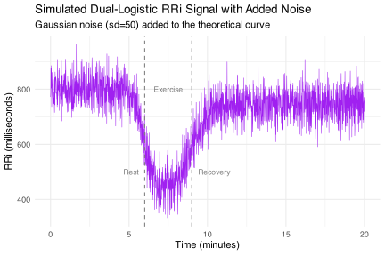

# CardioCurveR <a href="https://matcasti.github.io/CardioCurveR/"></a>

<!-- README.md is generated from README.Rmd. Please edit that file -->

[](https://lifecycle.r-lib.org/articles/stages.html#experimental)
[](https://CRAN.R-project.org/package=CardioCurveR)
[](https://github.com/matcasti/CardioCurveR/actions/workflows/R-CMD-check.yaml)
[](https://app.codecov.io/gh/matcasti/CardioCurveR)

## Nonlinear Modeling of R-R Interval Dynamics with CardioCurveR

**CardioCurveR** offers a sophisticated yet accessible framework
specifically engineered for the quantitative analysis of R-R interval
(RRi) dynamics, particularly in response to physiological stimuli like
exercise. Modeling these dynamics accurately is crucial for
understanding cardiovascular control, but it presents challenges due to
the complex, non-linear nature of heart rate changes and the presence of
noise and artifacts in typical recordings. The core of this package is
built upon a **dual-logistic mathematical model**, meticulously detailed
by [Castillo-Aguilar et
al. (2025)](https://www.nature.com/articles/s41598-025-93654-6). This
specific model structure was chosen because it elegantly captures the
two primary phases characteristic of many exercise protocols: the
relatively rapid decrease in RRi (increase in heart rate) at the onset
of exertion, followed by a distinct recovery phase where RRi increases
(heart rate decreases) after the cessation of exercise.

Mathematically, the relationship between the R-R interval ($RRi$) and
time ($t$) is expressed by the following equation:

$$
RRi(t) = \underbrace{\alpha}_{\text{Baseline}} + \underbrace{\frac{\beta}{1 + e^{\lambda\ (t-\tau)}}}_{\text{Drop Phase}} + \underbrace{\frac{-c\ \cdot \beta}{1 + e^{\phi\ (t-\tau-\delta)}}}_{\text{Recovery Phase}}
$$

Let’s dissect this equation and the physiological meaning imbued in its
parameters:

- The equation essentially combines two logistic functions (S-shaped
  curves) to represent the two key transitions.
- **$\alpha$ (alpha): Baseline RRi Level.** This parameter establishes
  the foundational, resting R-R interval duration *before* any
  significant change occurs, typically representing the pre-exercise
  state. It’s the value the curve approaches as time ($t$) goes towards
  negative infinity (or the start of the observation period).
- **$\beta$ (beta): Primary Amplitude of Change (Drop).** Beta governs
  the total magnitude of the *decrease* in RRi during the exercise onset
  phase. Since $\beta$ is typically negative for an RRi drop (heart rate
  increase), its absolute value represents the depth of this initial
  response relative to the baseline $\alpha$.
- **$\lambda$ (lambda): Steepness of the Drop Phase.** This parameter
  dictates the rate of change during the initial RRi decrease. A larger
  absolute value of $\lambda$ (given it’s usually negative for the drop)
  results in a sharper, faster transition from the resting state to the
  exercise state.
- **$\tau$ (tau): Temporal Center of the Drop Phase.** Tau pinpoints the
  time point around which the most significant portion of the RRi drop
  occurs. It acts as the inflection point for the first logistic
  component, effectively locating the exercise onset transition in time.
- **$c$ (c): Recovery Amplitude Scaling Factor.** This parameter links
  the magnitude of the recovery phase to the magnitude of the initial
  drop ($\beta$). The term `-c * \beta` defines the amplitude of the
  *increase* in RRi during recovery. If $c=1$, the recovery amplitude
  mirrors the drop amplitude. Values of $c$ different from 1 allow the
  model to capture scenarios where the recovery magnitude differs from
  the initial drop (e.g., incomplete recovery within the observed
  timeframe).
- **$\phi$ (phi): Steepness of the Recovery Phase.** Analogous to
  $\lambda$, $\phi$ controls the steepness or rate of change during the
  post-exercise recovery phase (RRi increase). A larger absolute value
  of $\phi$ (usually negative in this formulation for an *increasing*
  RRi during recovery described by the second logistic term’s structure)
  signifies a faster return towards the baseline or a new steady state.
- **$\delta$ (delta): Temporal Shift of the Recovery Phase.** Delta
  introduces a time delay or advance for the recovery phase relative to
  the drop phase centered at $\tau$. It allows the recovery curve
  component (the second logistic function) to be centered effectively at
  $t = \\tau + \\delta$, providing flexibility to accurately model the
  timing between the end of the exercise stimulus and the initiation of
  the recovery dynamics.

<figure>

<figcaption aria-hidden="true">Detailed breakdown showing how alpha sets
the baseline, the first logistic term creates the drop controlled by
beta, lambda, and tau, and the second logistic term creates the recovery
controlled by c*beta, phi, and delta.</figcaption>
</figure>

Beyond the core modeling equation, **CardioCurveR** integrates crucial
pre-processing steps essential for handling real-world data. It employs
advanced signal filtering techniques, specifically utilizing a
**zero-phase Butterworth low-pass filter**. A low-pass filter is
designed to remove high-frequency fluctuations, often considered noise
(e.g., from measurement inaccuracies, muscle artifacts, or minor
physiological variations), while preserving the slower, underlying trend
of interest (the exercise and recovery response). The “Butterworth”
design provides a maximally flat frequency response in the passband.
Critically, the filtering is applied using a “zero-phase” technique
(commonly achieved with forward-backward filtering, like the `filtfilt`
function used internally). This ensures that the filtering process does
not introduce any time lag or shift into the signal, which is vital for
accurately estimating time-related parameters like $\tau$ and $\delta$.
Furthermore, CardioCurveR addresses the common issue of **edge
artifacts** – distortions that filtering can introduce at the very
beginning and end of a signal due to the filter’s initialization and
settling requirements. The package includes mechanisms, like trimming a
small number of samples from both ends post-filtering, to mitigate the
impact of these artifacts on the subsequent modeling. This comprehensive
approach ensures that the RRi data fed into the non-linear modeling
stage is clean and representative of the true physiological dynamics.

## Installation Guide: Getting CardioCurveR into Your R Environment

You have two primary ways to install the **CardioCurveR** package,
depending on whether you need the official stable release or the latest
development version.

### 1. Installing the Stable Version from CRAN (Recommended)

For most users, the recommended method is to install the package from
the Comprehensive R Archive Network (CRAN). CRAN hosts official releases
of R packages that have undergone checks and are considered stable.
Installation from CRAN is typically straightforward as it usually
provides pre-compiled versions (binaries) for Windows and macOS,
avoiding the need for additional system tools.

To install the stable version of **CardioCurveR** from CRAN, simply run
the following command in your R console:

``` r
# Installs the official release version of CardioCurveR from CRAN
# R will automatically handle downloading and installing any required
# dependency packages as well.
install.packages("CardioCurveR")
```

Make sure you have an active internet connection. This command will
download the package files from a CRAN mirror and install them into your
R library, making the package ready to be loaded with
`library(CardioCurveR)`. This is generally the easiest and most reliable
installation method for regular use.

### 2. Installing the Development Version from GitHub (Advanced Users / Latest Features)

Alternatively, if you want to access the absolute latest features,
improvements, or bug fixes that might not yet be available in the
official CRAN release, you can install the development version directly
from its GitHub repository. This method requires the **devtools**
package, a toolkit specifically designed for package development tasks,
including installing packages from GitHub.

First, ensure you have the **devtools** package installed. The following
R code checks if **devtools** is present and installs it from CRAN if
necessary:

``` r
# Check if the 'devtools' package is installed.
# 'requireNamespace' checks without loading the package, and 'quietly = TRUE'
# suppresses messages. If it returns FALSE, 'devtools' is not installed.
if (!requireNamespace("devtools", quietly = TRUE)) {
  # If 'devtools' is not found, install it from CRAN first.
  # This requires an internet connection.
  install.packages("devtools")
}
```

Once **devtools** is available, you can use its `install_github()`
function to download and install **CardioCurveR** directly from the
specified repository (‘matcasti/CardioCurveR’):

``` r
# Use devtools::install_github() to install CardioCurveR
# directly from the 'matcasti/CardioCurveR' GitHub repository.
# This function downloads the source code, potentially compiles
# code if needed (see note below), and installs the package.
devtools::install_github("matcasti/CardioCurveR")
```

**Note on GitHub Installations:** Installing from GitHub compiles the
package from source. On some operating systems, this might require
additional development tools: \* **Windows:** You may need to install
Rtools. \* **macOS:** You might need Xcode and its Command Line Tools.
\* **Linux:** You typically need `r-base-dev`, `build-essential`, or
similar packages providing C/C++/Fortran compilers.

Check the R documentation or messages during installation if you
encounter issues related to compilation.

**Which method should you choose?**

- Use `install.packages("CardioCurveR")` for the stable, officially
  released version (recommended for most users and reproducible
  research).
- Use `devtools::install_github("matcasti/CardioCurveR")` if you
  specifically need the latest development updates or features not yet
  on CRAN, and you are comfortable potentially needing extra setup steps
  for source compilation.

After installation using either method, you can load the package into
your R session using `library(CardioCurveR)`.

## Exploring the Core Functions of CardioCurveR

The **CardioCurveR** package provides a suite of functions designed to
streamline the process of analyzing RRi data, from cleaning and
filtering to modeling and estimation. Here’s a more detailed look at the
key functions:

### `dual_logistic()`: Implementing the Core Mathematical Model

This function serves as the mathematical engine of the package. It
directly implements the dual-logistic equation described previously:

$$
RRi(t) = \alpha + \frac{\beta}{1 + e^{\lambda (t-\tau)}} - \frac{c\,\beta}{1 + e^{\phi (t-\tau-\delta)}}
$$

**Purpose:** Its primary role is to calculate the predicted R-R interval
value(s) based on the dual-logistic model for a given set of time points
and a specific set of parameter values.

**Inputs:**

- `time`: A numeric vector representing the time points at which you
  want to calculate the RRi values.
- `params`: A named vector or list containing the values for the seven
  model parameters: `alpha`, `beta`, `lambda`, `tau`, `c`, `phi`, and
  `delta`. The names must match exactly. **Output:** It returns a
  numeric vector of the same length as the input `time` vector,
  containing the calculated RRi values according to the model and the
  provided parameters. **Usage:** This function is used internally by
  the estimation function (`estimate_RRi_curve`) during the optimization
  process. It’s also extremely useful for users to simulate theoretical
  curves (as shown in the example) or to generate predicted RRi values
  once a model has been fitted.

### `estimate_RRi_curve()`: Estimating Model Parameters from Data

This is arguably the central function for users analyzing their own
data. It takes empirical RRi data and finds the optimal set of
parameters for the `dual_logistic` model that best describes that data.

**Purpose:** To perform the non-linear regression, estimating the seven
parameters ($\alpha, \beta, \lambda, \tau, c, \phi, \delta$) of the
dual-logistic model based on observed time and RRi data.

**Methodology:**

- **Optimization:** It employs R’s powerful `optim()` function for
  numerical optimization. By default, it uses the `"L-BFGS-B"` method,
  which is a quasi-Newton algorithm capable of handling box constraints
  (lower and upper bounds) on the parameters. This is important for
  ensuring physiologically plausible parameter estimates (e.g.,
  constraining $\alpha$ to be positive).
- **Loss Function:** Instead of minimizing the standard sum of squared
  errors (which is sensitive to outliers), this function minimizes the
  **Huber loss**. The Huber loss function is a robust alternative that
  behaves like the squared error loss for small errors but like the
  absolute error loss for large errors. This makes the parameter
  estimation less influenced by potential outliers or unusually noisy
  data points that might still be present after initial cleaning.

**Inputs:**

- `time`: A numeric vector of time points corresponding to the RRi
  measurements.
- `RRi`: A numeric vector of the observed R-R interval measurements.
  **Output:** It returns a list-like object containing detailed results
  of the estimation, including the estimated `parameters`,
  goodness-of-fit statistics (like R-squared, RMSE, MAPE), information
  about the optimization convergence, and potentially the residuals.

### `filter_signal()`: Pre-processing via Signal Filtering

This function handles the crucial step of noise reduction in the raw RRi
signal before modeling.

**Purpose:** To apply a digital low-pass filter to the RRi time series
to smooth out high-frequency noise while preserving the underlying
physiological trend.

**Methodology:**

- **Filter Type:** It uses a **Butterworth filter**, known for its flat
  response in the frequency range it allows through (the passband),
  avoiding ripples.
- **Zero-Phase Filtering:** It applies the filter using a
  forward-and-backward pass (`filtfilt` methodology). This clever
  technique effectively cancels out the phase distortion (time delay)
  that a standard one-way filter would introduce, which is critical for
  accurate temporal parameter estimation.
- **Edge Effect Mitigation:** Recognising that digital filters can
  produce unreliable values at the very start and end of the signal (due
  to initialization effects), the function typically includes a step to
  **trim** a specified number of data points from both ends of the
  *filtered* signal. The corresponding time points are also removed to
  maintain alignment. Users should be aware that this slightly shortens
  the time series being analyzed.

**Inputs:**

- `RRi`: The numeric vector of the RRi signal to be filtered.
- Other arguments (check function documentation with `?filter_signal`)
  likely control the filter order, cutoff frequency, and the number of
  points to trim. **Output:** A numeric vector containing the filtered
  RRi signal (potentially shorter than the input due to trimming).

### `clean_outlier()`: Adaptive Cleaning of Ectopic Beats and Noise

This function provides a sophisticated method for identifying and
correcting outlier points in the RRi signal, often corresponding to
ectopic beats or significant measurement errors.

**Purpose:** To detect physiologically implausible RRi values (outliers)
and replace them with more reasonable estimates based on the local trend
of the signal.

**Methodology:**

1.  **Trend Estimation:** It first fits a **LOESS** (Locally Estimated
    Scatterplot Smoothing) model to the RRi data. LOESS is a
    non-parametric technique that fits simple polynomial models to
    localized subsets of the data, providing a flexible way to capture
    the underlying, possibly non-linear, trend without assuming a global
    structure like the dual-logistic model yet.
2.  **Residual Calculation:** It calculates the residuals, which are the
    differences between the original RRi values and the values predicted
    by the LOESS smooth curve.
3.  **Outlier Detection:** Outliers are identified based on these
    residuals. A point is flagged as an outlier if its residual exceeds
    a certain threshold. This threshold is typically defined as a
    multiple (e.g., 3 or 4) of a robust measure of the spread of the
    residuals, usually the **Median Absolute Deviation (MAD)**. Using
    MAD makes the detection process itself robust to the presence of
    outliers (unlike standard deviation).
4.  **Outlier Replacement:** Detected outliers are replaced using one of
    several user-selectable methods:
    - `gaussian`: Replace with a random value drawn from a Gaussian
      distribution centered on the LOESS prediction, with variance
      estimated from the non-outlier residuals.
    - `uniform`: Replace with a random value drawn from a uniform
      distribution around the LOESS prediction.
    - `loess`: Simply replace with the value predicted by the LOESS
      smooth curve at that time point. The choice of method depends on
      whether the user prefers a smoother replacement or wants to retain
      some local variability.

**Inputs:**

- `RRi`: The numeric vector of the RRi signal containing potential
  outliers.
- Arguments to control the LOESS span, outlier threshold (multiple of
  MAD), and replacement method (check `?clean_outlier`). **Output:** A
  numeric vector of the RRi signal with identified outliers replaced.

## Comprehensive Example Workflow: From Simulation to Estimation

This extended example provides a practical demonstration of the entire
**CardioCurveR** workflow, starting from simulating data that mimics
real-life RRi signals, applying cleaning and filtering, fitting the
model, and finally evaluating the results. This is invaluable for
understanding how the different functions work together and for
verifying the package’s capabilities.

First, ensure the **CardioCurveR** package is loaded into your current R
session (assuming you have successfully installed it as per the
instructions above).

``` r
# Load the package to make its functions available
library(CardioCurveR)
```

Next, we’ll simulate an RRi dataset. We start by defining a time
sequence and then using the `dual_logistic()` function with a known set
of ‘true’ parameters to generate a perfect, theoretical RRi curve. This
represents the underlying physiological process we aim to uncover later.
The parameters are chosen based on typical values reported in
literature, such as [Castillo-Aguilar et
al. (2025)](https://www.nature.com/articles/s41598-025-93654-6).

``` r
# Create a time vector from 0 to 20 minutes with steps of 0.01 minutes.
# This high resolution simulates beat-to-beat data.
time <- seq(0, 20, by = 0.01)

# Define a list containing the 'true' parameter values that will generate our signal.
# These represent a hypothetical ground truth for simulation purposes.
true_params <- list(alpha = 800, beta = -375, c = 0.85,
                    lambda = -3, phi = -2,
                    tau = 6, delta = 3) # Note: Parameter values are illustrative

# Calculate the theoretical RRi values at each time point using the dual_logistic function
# and the defined true parameters.
RRi_theoretical <- dual_logistic(time, true_params)
```

Let’s peek at the structure of this simulated theoretical data. It’s
simply a sequence of RRi values corresponding to each time point.

    #>       time  RRi_theoretical
    #> 1        0 799.999999143314
    #> 2     0.01 799.999999067449
    #> 3     0.02 799.999998988268
    #> ...    ...              ...
    #> 1999 19.98 743.749999907457
    #> 2000 19.99  743.74999990929
    #> 2001    20 743.749999911086

Visualizing this theoretical curve helps understand the ideal shape
defined by our parameters. We’ll use the powerful **ggplot2** package
for creating informative plots.

``` r
library(ggplot2) # Ensure ggplot2 is loaded

# Create a plot of the theoretical RRi curve against time
ggplot() +
  # Add a line geom mapping time to x-axis and theoretical RRi to y-axis
  geom_line(aes(time, RRi_theoretical), linewidth = 1, col = "purple") +
  # Add informative labels and title
  labs(title = "Theoretical Dual-Logistic RRi Model",
       subtitle = "Generated using dual_logistic() with true_params",
       x = "Time (minutes)", y = "RRi (milliseconds)") +
  # Use a clean minimal theme
  theme_minimal()
```


Real-world RRi data is never perfectly smooth. To make our simulation
more realistic, we’ll add random noise. We use `rnorm()` to generate
noise from a normal (Gaussian) distribution with a mean of 0 and a
specified standard deviation (`sd = 50` ms in this case), adding it to
the theoretical curve. `set.seed(123)` ensures that the random noise
generated is reproducible if you run the code again.

``` r
set.seed(123) # Set the random number generator seed for reproducibility

# Add normally distributed random noise to the theoretical RRi signal.
# sd=50 introduces realistic variability around the true curve.
RRi_simulated <- RRi_theoretical + rnorm(length(time), mean = 0, sd = 50)
```

Let’s visualize this noisy signal. We also add vertical lines and text
annotations to indicate hypothetical rest, exercise, and recovery
periods, based loosely on the `tau` and `delta` parameters.

``` r
ggplot() +
  # Plot the noisy simulated RRi signal
  geom_line(aes(time, RRi_simulated), linewidth = 1/4, col = "purple") +
  # Add vertical lines to demarcate phases (centered around tau=6 and tau+delta=9)
  geom_vline(xintercept = c(6, 9), linetype = "dashed", col = "gray50") +
  # Add text labels for the phases
  annotate("text", x = 5.6, y = 500, label = "Rest", col = "gray50", hjust = 1, size = 3) +
  annotate("text", x = 7.5, y = 800, label = "Exercise", col = "gray50", hjust = 0.5, size = 3) +
  annotate("text", x = 9.4, y = 500, label = "Recovery", col = "gray50", hjust = 0, size = 3) +
  # Add labels and title
  labs(title = "Simulated Dual-Logistic RRi Signal with Added Noise",
       subtitle = "Gaussian noise (sd=50) added to the theoretical curve",
       x = "Time (minutes)", y = "RRi (milliseconds)") +
  theme_minimal()
```



To further mimic reality, physiological signals often contain artifacts
like ectopic beats. We simulate this by randomly selecting a small
percentage (5%) of the data points and drastically altering their values
(multiplying by 0.3 or 1.7).

``` r
set.seed(1234) # Use a different seed for this random process

# Determine the total number of data points
n_samples <- length(time)

# Randomly select indices for 5% of the samples to become 'ectopics'
ectopic_indices <- sample.int(n = n_samples, size = floor(n_samples * 0.05))

# Modify the RRi values at these indices by multiplying by either 0.3 or 1.7
# This creates artificially large deviations from the surrounding signal.
RRi_simulated[ectopic_indices] <- RRi_simulated[ectopic_indices] * sample(c(0.3, 1.7), size = length(ectopic_indices), replace = TRUE)
```

Now, let’s visualize the signal with *both* noise and simulated ectopic
beats. This represents the challenging ‘raw’ data we often start with.

``` r
ggplot() +
  # Plot the noisy signal now including ectopic beats
  geom_line(aes(time, RRi_simulated), linewidth = 1/4, col = "purple") +
  # Add phase demarcation lines and labels again
  geom_vline(xintercept = c(6, 9), linetype = "dashed", col = "gray50") +
  annotate("text", x = 5.6, y = 500, label = "Rest", col = "gray50", hjust = 1, size = 3) +
  annotate("text", x = 7.5, y = 800, label = "Exercise", col = "gray50", hjust = 0.5, size = 3) +
  annotate("text", x = 9.4, y = 500, label = "Recovery", col = "gray50", hjust = 0, size = 3) +
  # Add labels and title
  labs(title = "Simulated RRi Signal with Noise and Ectopic Beats",
       subtitle = "Represents typical challenging 'raw' data",
       x = "Time (minutes)", y = "RRi (milliseconds)") +
  theme_minimal()
```


(**Aside**: This simulated dataset, including noise and ectopics, is
actually included within the CardioCurveR package as `sim_RRi`. You can
load it using `data(sim_RRi)` and explore its documentation with
`?sim_RRi` for practice.)

Okay, we have our realistic but messy simulated data. The crucial
question is: Can **CardioCurveR** effectively process this signal and
recover the underlying smooth, theoretical curve we started with? This
is the core challenge the package aims to solve.

### Step 1: Cleaning the RRi Data

First, we address the ectopic beats using the `clean_outlier()`
function. This function will identify and replace the artificially large
deviations we introduced.

``` r
# Apply the outlier cleaning function to the simulated RRi data
# Using default settings for LOESS span, threshold, and replacement method.
RRi_cleaned <- clean_outlier(RRi_simulated)
```

Let’s visualize the effect of cleaning. We overlay the cleaned signal
(in blue) on the original messy signal (in purple).

``` r
ggplot() +
  # Plot the original signal (with ectopics) faintly in purple
  geom_line(aes(time, RRi_simulated), linewidth = 1/4, col = "purple", alpha = 0.5) +
  # Plot the cleaned signal (ectopics replaced) in blue
  geom_line(aes(time, RRi_cleaned), linewidth = 1/4, col = "blue") +
  # Add labels and title
  labs(title = "Effect of Outlier Cleaning",
       subtitle = "Original Signal (Purple) vs. Cleaned Signal (Blue)",
       x = "Time (minutes)", y = "RRi (milliseconds)") +
  theme_minimal()
```


You should see that the large spikes (ectopics) present in the purple
line have been smoothed out in the blue line, which now follows the
general trend more closely.

Next, we apply the low-pass filter using `filter_signal()` to remove the
remaining high-frequency Gaussian noise.

``` r
# Apply the zero-phase Butterworth low-pass filter to the cleaned signal
# This will smooth out the rapid fluctuations. Custom settings used to
# highlight the filtering capabilities only.
RRi_filtered <- filter_signal(RRi_cleaned, W = 0.2)

# Visualize the cleaned signal vs the filtered signal
ggplot() +
  # Plot the cleaned signal (ectopics removed but still noisy) in purple
  geom_line(aes(time, RRi_cleaned), linewidth = 1/4, col = "purple", alpha = 0.5) +
  # Plot the filtered signal (smoothed) in blue. na.rm=TRUE handles potential NAs from trimming.
  geom_line(aes(time, RRi_filtered), linewidth = 1/2, col = "blue", na.rm = TRUE) +
  # Add labels and title
  labs(title = "Effect of Low-Pass Filtering",
       subtitle = "Cleaned Signal (Purple) vs. Filtered Signal (Blue)",
       x = "Time (minutes)", y = "RRi (milliseconds)") +
  theme_minimal()
```


(**Aside**: Here, we used a low-pass filter of `W = 0.2` for
visualization purposes. However, this configuration might be filtering
too much of the physiological signal. By dafault, the `filter_signal()`
function uses `W = 0.5`, which might be better for most use cases as it
preserves most of the physiologically relevant fluctuations.)

The blue line should now appear much smoother than the purple line,
representing our best estimate of the underlying physiological trend
after removing both ectopic beats and random noise. Note that the
filtered signal might be slightly shorter at the ends if trimming was
applied by `filter_signal()`.

### Step 2: Estimating the RRi Model Parameters

With the pre-processed (cleaned and filtered) RRi signal, we can finally
estimate the parameters of the dual-logistic model using
`estimate_RRi_curve()`.

``` r
# Fit the dual-logistic model to the filtered time and RRi data.
# The function performs the robust optimization to find the best parameters.
# 
# Note: We must provide the 'time' vector that corresponds to the potentially trimmed 'RRi_filtered'.

# Pass filtered RRi and corresponding time
fit_summary <- estimate_RRi_curve(time, RRi_filtered)

# Print the primary results, focusing on the estimated parameters.
print(fit_summary)
#> RRi_fit Object
#> Optimization Method: L-BFGS-B 
#> Estimated Parameters:
#>        alpha         beta            c       lambda          phi          tau 
#>  802.7038430 -379.1634841    0.8498156   -2.8539406   -1.9124351    6.0018920 
#>        delta 
#>    3.0004803 
#> Objective Value (Huber loss): 357551.5 
#> Convergence Code: 0
```

The output shows the parameter values
($\alpha, \beta, \lambda, \tau, c, \phi, \delta$) estimated by the model
from our noisy, artifact-laden simulated data. Compare these estimated
values to the `true_params` we used initially
(`alpha = 800, beta = -375`, etc.). They should be reasonably close,
demonstrating the model’s ability to recover the original parameters
despite of the extreme outliers and noisy signal.

We can get more detailed statistics about the fit using the `summary()`
function.

``` r
# Obtain a more comprehensive summary of the model fit.
summary(fit_summary)
#> Summary of RRi_fit Object
#> Optimization Method: L-BFGS-B 
#> Estimated Parameters:
#>        alpha         beta            c       lambda          phi          tau 
#>  802.7038430 -379.1634841    0.8498156   -2.8539406   -1.9124351    6.0018920 
#>        delta 
#>    3.0004803 
#> 
#> Objective Value (Huber loss): 357551.5 
#> Residual Sum of Squares (RSS): 716606.3 
#> Total Sum of Squares (TSS): 21436042 
#> R-squared: 0.9666 
#> Root Mean Squared Error (RMSE): 19  ms 
#> Mean Absolute Percentage Error (MAPE): 2.2  % 
#> Number of observations: 1991 
#> Convergence Code: 0
```

This summary typically includes goodness-of-fit metrics:

- **R-squared (R²)**: Indicates the proportion of the variance in the
  filtered RRi data that is explained by the fitted model. A value of
  0.966 means ~96.6% of the variance is captured, which is quite good
  considering the noise we added.
- **RMSE (Root Mean Squared Error)**: Represents the typical magnitude
  of the error (residuals) between the model’s predictions and the
  actual filtered data, in the original units (ms). An RMSE of ~20 ms is
  reported here.
- **MAPE (Mean Absolute Percentage Error)**: Expresses the average error
  as a percentage of the actual RRi values. A MAPE of 2.2% indicates the
  average prediction error is about 2.2% of the RRi value.

Visual diagnostics are also crucial. We use the specialized `plot()`
method for the fitted model object.

``` r
# Generate diagnostic plots for the fitted model.
plot(fit_summary)
```


Examine these plots carefully:

1.  **Fitted Line vs. Data:** The top plot shows the filtered RRi signal
    (in purple) overlaid with the smooth predicted curve from the
    estimated model (in blue). The blue line should closely follow the
    central trend of the purple line.
2.  **Residuals vs. Time:** The middle plot shows the residuals
    (filtered RRi - predicted RRi) plotted against time. Ideally, these
    residuals should be randomly scattered around the horizontal zero
    line, with no discernible patterns (like curves, trends, or funnel
    shapes). This indicates that the model has captured the systematic
    variation, leaving only random noise.
3.  **Histogram of Residuals:** The bottom plot shows the distribution
    of the residuals. For well-behaved fits (especially if underlying
    noise was normal), this histogram should look roughly symmetric and
    bell-shaped, centered around zero.

These diagnostics suggest the model fits the processed data well.

### Step 3: Comparing Estimated vs. True Model

Finally, the ultimate test in a simulation study is to compare the curve
generated by the *estimated* parameters directly against the *true*
theoretical curve we started with before adding any noise or artifacts.

``` r
# Calculate the RRi curve predicted by the *estimated* parameters
RRi_estimated <- dual_logistic(time, fit_summary$parameters)

# Plot the original theoretical curve (purple) and the estimated curve (blue) together
ggplot() +
  # Plot the true theoretical curve
  geom_line(aes(time, RRi_theoretical), linewidth = 1.0, col = "purple", linetype = "solid") +
  # Plot the curve generated from the estimated parameters
  geom_line(aes(time, RRi_estimated), linewidth = 1.0, col = "blue", linetype = "dashed") +
  # Add labels and title for comparison
  labs(title = "Comparison: True vs. Estimated RRi Model Curves",
       subtitle = "True Underlying Curve (Purple) vs. Model Estimated from Noisy Data (Blue)",
       y = "RRi (milliseconds)", x = "Time (minutes)") +
  theme_minimal()
```


As you can observe from this plot, the dashed blue line (estimated
model) closely overlays the solid purple line (true underlying process).
This visually confirms that the **CardioCurveR** workflow, including
robust cleaning, filtering, and parameter estimation, was successful in
reverse-engineering the fundamental physiological dynamics even from a
significantly corrupted signal.

This comprehensive example walked through simulating realistic RRi data,
applying essential pre-processing steps (`clean_outlier`,
`filter_signal`), estimating the core physiological parameters using the
robust `estimate_RRi_curve` function, and evaluating the fit both
statistically and visually. The successful recovery of the underlying
theoretical curve highlights the power and utility of **CardioCurveR**
for analyzing complex RRi dynamics.

We encourage you to experiment with this workflow, perhaps modifying the
noise levels, the number of ectopic beats, or even the true parameters,
to further explore the capabilities and robustness of modeling RR
interval dynamics with **CardioCurveR**!

For a more basic and introductory guide, go check the [Get
Started](https://matcasti.github.io/CardioCurveR/articles/CardioCurveR.html)
article, where we cover the same workflow with minimal additional code,
best for newcomers and beginners.

Enjoy your analyses!
