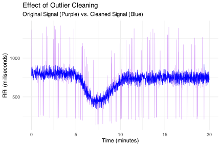

CardioCurveR: Nonlinear Modeling of R-R Interval Dynamics
================

<!-- README.md is generated from README.Rmd. Please edit that file -->

[](https://lifecycle.r-lib.org/articles/stages.html#experimental)
[](https://CRAN.R-project.org/package=CardioCurveR)
[](https://github.com/matcasti/CardioCurveR/actions/workflows/R-CMD-check.yaml)
[](https://app.codecov.io/gh/matcasti/CardioCurveR)

CardioCurveR provides an automated and robust framework for modeling RR
interval (RRi) signals. The package is built around a dual-logistic
model, as described by [Castillo-Aguilar et
al. (2025)](https://www.nature.com/articles/s41598-025-93654-6), which
captures both the rapid drop in RRi during exercise and the subsequent
recovery phase. In our formulation, the model is defined by the
following equation:

$$
RRi(t) = \alpha + \frac{\beta}{1 + e^{\lambda\ (t-\tau)}} - 
         \frac{c\,\beta}{1 + e^{\phi\ (t-\tau-\delta)}},
$$

where $\alpha$ represents the baseline RRi level, $\beta$ controls the
amplitude of the drop, $\lambda$ modulates the steepness of the drop
phase, $\tau$ is the time center of the drop, $c$ scales the recovery
amplitude relative to $\beta$, $\phi$ controls the steepness of the
recovery phase, and $\delta$ shifts the recovery phase in time relative
to the drop.

CardioCurveR also incorporates advanced signal filtering techniques
using a zero-phase Butterworth filter to preprocess the RRi data and
remove edge artifacts. This ensures that the dynamic fluctuations are
preserved for subsequent non-linear modeling.

## Installation

To install the development version of CardioCurveR, run the following
commands in R. Make sure that you have the **devtools** package
installed:

``` r
if (!requireNamespace("devtools", quietly = TRUE)) {
  install.packages("devtools")
}

devtools::install_github("matcasti/CardioCurveR")
```

## Core Functions

The package provides several key functions:

### Dual-Logistic Model: `dual_logistic()`

This function implements the dual-logistic model from [Castillo-Aguilar
et al. (2025)](https://www.nature.com/articles/s41598-025-93654-6):

$$
RRi(t) = \alpha + \frac{\beta}{1 + e^{\lambda (t-\tau)}} - \frac{c\,\beta}{1 + e^{\phi (t-\tau-\delta)}}
$$

It takes a vector of time points and a named vector (or list) of
parameters, returning the modeled RRi values.

### Parameter Estimation: `estimate_RRi_curve()`

This function optimizes the dual-logistic model parameters using a
robust Huber loss function. The optimization is performed via the
`optim()` function with box constraints (default method `"L-BFGS-B"`).
It is designed to yield reliable parameter estimates even in the
presence of noisy data.

### Signal Filtering: `filter_signal()`

This function applies a Butterworth low-pass filter using zero-phase
filtering (with `filtfilt()`) to clean the RRi signal. To mitigate edge
effects from filtering, it trims a specified number of samples from the
beginning and end of the filtered signal.

### Adaptive Outlier Cleaning: `clean_outlier()`

The `clean_outlier()` function removes ectopic or noisy beats from an
RRi signal. It fits a LOESS model to capture local trends, calculates
residuals, and flags outliers based on a robust threshold (multiples of
the median absolute deviation). Outliers are then replaced by one of
three methods: drawing from a Gaussian or uniform distribution, or
simply replacing with the LOESS-predicted values.

## Example Workflow

### Generating real-life data

Below is an extended example that demonstrates the full workflow of
simulating, filtering, visualizing, and fitting an RRi signal model.

First we load the package `CardioCurveR`, assuming that you first
installed it.

``` r
library(CardioCurveR)
```

Then, we simulate data with specific parameters from the dual-logistic
model described in Castillo-Aguilar et al. (2025).

``` r
# Simulate a time vector and a theoretical RRi signal using the dual-logistic model.
time <- seq(0, 20, by = 0.01)

# Define the true model parameters from Castillo-Aguilar et al. (2025)
true_params <- list(alpha = 800, beta = -375, c = 0.85, 
                    lambda = -3, phi = -2, 
                    tau = 6, delta = 3)

# Compute the theoretical RRi curve using dual_logistic()
RRi_theoretical <- dual_logistic(time, true_params)
```

And our simulated data will look something like this:

    #>       time  RRi_theoretical
    #> 1        0 799.999999143314
    #> 2     0.01 799.999999067449
    #> 3     0.02 799.999998988268
    #> ...    ...              ...
    #> 1999 19.98 743.749999907457
    #> 2000 19.99  743.74999990929
    #> 2001    20 743.749999911086

We can visualize the generated theoretical curve generated with the
`dual_logistic()` function by leveraging `ggplot2` grammar of graphics
like this:

``` r
library(ggplot2) ## Load ggplot2 package

# Visualize the theoretical model
ggplot() +
  geom_line(aes(time, RRi_theoretical), linewidth = 1, col = "purple") +
  labs(title = "Theoretical Dual-Logistic RRi Model",
       subtitle = "Generated with the `dual_logistic()` function",
       x = "Time (min)", y = "RRi (ms)") +
  theme_minimal()
```


We can additionally generate random noise around our theoretical curve
to simulate a real R-R interval signal (because life, has randomness in
it):

``` r
set.seed(123) # Seed for reproducibility

# Simulate a noisy RRi signal by adding Gaussian noise
RRi_simulated <- RRi_theoretical + rnorm(length(time), sd = 50)
```

So now, we added noise to our perfectly smooth signal, let’s see how
does it look now:

``` r
ggplot() +
  geom_line(aes(time, RRi_simulated), linewidth = 1/4, col = "purple") +
  geom_vline(xintercept = c(6,9), linetype = 2, col = "gray50") +
  annotate("text", x = 5.0-0.2, y = 500, label = "Rest", col = "gray50", 
           hjust = 1, cex = 3) +
  annotate("text", x = 7.5, y = 800, label = "Exercise", col = "gray50", 
           hjust = 0.5, cex = 3) +
  annotate("text", x = 10+0.2, y = 500, label = "Recovery", col = "gray50", 
           hjust = 0, cex = 3) +
  labs(title = "Simulated Dual-Logistic RRi Signal",
       subtitle = "With Random Gaussian Noise Added",
       x = "Time (min)", y = "RRi (ms)") +
  theme_minimal()
```


So as we see, our model also works to generate and simulate data with
noise included, which will serve our purpose to illustrate how we can
reverse-engineer the noisy RRi signal back to our theoretical curve.

Let’s first add some ectopic signals to make it look even more real:

``` r
set.seed(1234) ## Seed for reproducibility

## Total number of RRi records or points
n_samples <- length(time)

## We'll select random points (5% of whole signal)
ectopics <- sample.int(n = n_samples, size = floor(n_samples * 0.05))

## We'll add a doubled or half value to selected ectopic data points
RRi_simulated[ectopics] <- RRi_simulated[ectopics] * c(0.3, 1.7)
```

Now let’s look how looks our noisy, unprocessed signal:

``` r
ggplot() +
  geom_line(aes(time, RRi_simulated), linewidth = 1/4, col = "purple") +
  geom_vline(xintercept = c(6,9), linetype = 2, col = "gray50") +
  annotate("text", x = 5.0-0.2, y = 500, label = "Rest", col = "gray50", 
           hjust = 1, cex = 3) +
  annotate("text", x = 7.5, y = 800, label = "Exercise", col = "gray50", 
           hjust = 0.5, cex = 3) +
  annotate("text", x = 10+0.2, y = 500, label = "Recovery", col = "gray50", 
           hjust = 0, cex = 3) +
  labs(title = "Simulated Dual-Logistic RRi Signal",
       subtitle = "With Random Noise and Ectopic Heartbeats Added",
       x = "Time (min)", y = "RRi (ms)") +
  theme_minimal()
```


(Fun fact, you can find this example dataset so you can practice by
calling the object `sim_RRi`, check out its documentations here:
`?sim_RRi`).

Okay so now this look like real-life signal data. Now the question lies:
Can we reverse-engineer this curve back to our nice and smooth
theoretical curve? That’s exactly the goal to this package. Let’s see
what can we do!

### Cleaning the RRi data

First, we need to remove ectopic signals. We can do this with our
`clean_outlier()` function like this:

``` r
## First we call our function
cleaned_data <- clean_outlier(time, RRi_simulated)

## And them, add the cleaned signal to our original table as another column
RRi_cleaned <- cleaned_data$signal
```

So now, let’s check how it looks our cleaned signal (without ectopic
hearbeats):

``` r
ggplot() +
  geom_line(aes(time, RRi_simulated), linewidth = 1/4, col = "purple") +
  geom_line(aes(time, RRi_cleaned), linewidth = 1/4, col = "blue") +
  labs(title = "Simulated Dual-Logistic RRi Signal",
       subtitle = "Original (Purple) and Cleaned Signal (Blue)",
       x = "Time (min)", y = "RRi (ms)") +
  theme_minimal()
```



Additionally, we can now filter the noise we add initially (the random
gaussian noise) to clean even more our RRi signal. Let’s see how it
looks our RRi signal after filtering:

``` r
# Apply the Butterworth low-pass filter to the noisy RRi signal
RRi_filtered <- filter_signal(RRi_cleaned)

ggplot() +
  geom_line(aes(time, RRi_cleaned), linewidth = 1/4, col = "purple") +
  geom_line(aes(time, RRi_filtered), linewidth = 1/4, col = "blue", na.rm = TRUE) +
  labs(title = "Simulated Dual-Logistic RRi Signal",
       subtitle = "Cleaned signal (Purple) and Cleaned and Filtered Signal (Blue)",
       x = "Time (min)", y = "RRi (ms)") +
  theme_minimal()
```


With this filtered signal we can now focus on capturing the true
underlying theoretical curve rather than just capturing the noise from
the measurements.

### Estimating the RRi model

The estimation process of the original curve is rather simple: we call
the function `estimate_RRi_curve()` and plug the time and RRi vectors
inside.

``` r
# Estimate the dual-logistic model parameters from the noisy RRi signal
fit_summary <- estimate_RRi_curve(time, RRi_filtered)

## Lets print the results of the estimation of our model parameters
print(fit_summary)
#> RRi_fit Object
#> Optimization Method: L-BFGS-B 
#> Estimated Parameters:
#>        alpha         beta            c       lambda          phi          tau 
#>  800.3187317 -379.8993874    0.8606058   -2.9594002   -1.8927805    5.9759377 
#>        delta 
#>    3.0115352 
#> Objective Value (Huber loss): 921733.7 
#> Convergence Code: 0
```

And as simple as that we have fitted the dual logistic model to our
processed data. Let’s explore how well our model captured the pattern
from the generated data. We can further use other base functions to
explore the resulting object.

For instance, let’s call the `summary()` function to our object:

``` r
## Now lets see a summary with model fit statistics
summary(fit_summary)
#> Summary of RRi_fit Object
#> Optimization Method: L-BFGS-B 
#> Estimated Parameters:
#>        alpha         beta            c       lambda          phi          tau 
#>  800.3187317 -379.8993874    0.8606058   -2.9594002   -1.8927805    5.9759377 
#>        delta 
#>    3.0115352 
#> 
#> Objective Value (Huber loss): 921733.7 
#> Residual Sum of Squares (RSS): 1902518 
#> Total Sum of Squares (TSS): 23025287 
#> R-squared: 0.9174 
#> Root Mean Squared Error (RMSE): 30.9  ms 
#> Mean Absolute Percentage Error (MAPE): 3.6  % 
#> Number of observations: 1991 
#> Convergence Code: 0
```

We can see that the model have an `R-squared` of 0.917, which means that
is explaining about 91.7% of the variance contained in the generated RRi
signal (considering that we start with really messy and noisy RRi data).
The `RMSE` indicates that the average error of the model is only about
30 ms, which is equivalent to an error of 3.6 % according to the `MAPE`.

We can see plot model diagnostics using the `plot()` function. Let’s see
the result:

``` r
## Finally, lets see a plot with diagnostics statistics
plot(fit_summary)
```


The above plot should show the predicted RRi line (blue) closely
following the RRi signal. The middle plot should show that the residuals
of the model are evenly spread around the zero line. This is further
observed by the histogram of residuals which should be normally
distribuited around zero.

Let’s see how well our model did compared to the true underlying curve
that we used to generate the data!

``` r
## Add the simulated curve from the estimated parameters
RRi_estimated <- dual_logistic(time, fit_summary$parameters)

ggplot() +
  geom_line(aes(time, RRi_theoretical), linewidth = 1/2, col = "purple", linetype = 1) +
  geom_line(aes(time, RRi_estimated), linewidth = 1/2, col = "blue", linetype = 2) +
  labs(title = "True (Purple) and Estimated (Blue) RRi Model",
       y = "RRi (ms)", x = "Time (min)") +
  theme_minimal()
```


We can see that our model did a fairly well job capturing the underlying
true curve, which demonstrate our model’s capabilities in capturing the
RRi dynamics in response to exercise when this double-logistic behavior
is inherently present.

The above example demonstrates multiple steps. First, a theoretical RRi
signal is computed from the dual-logistic model. Next, a noisy version
of the signal is simulated and then cleaned using a Butterworth low-pass
filter. The cleaned signal is used to estimate the dual-logistic model
parameters through a robust optimization procedure. Visualizations are
provided for the theoretical curve, the noisy versus filtered signals,
the fitted model overlay, and the residuals of the fit, offering
comprehensive insight into each stage of the process.

Enjoy exploring your RR interval dynamics and modeling them robustly
with CardioCurveR!
