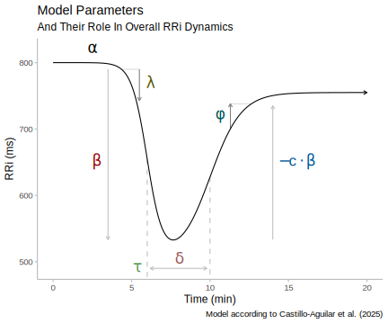

```{r, include = FALSE}
knitr::opts_chunk$set(
  collapse = TRUE,
  comment = "#>",
  dev = "svg",
  fig.ext = "svg",
  out.width = "100%",
  fig.width = 6,
  fig.height = 4
)
```

## Welcome to Your In-Depth Introduction to CardioCurveR!

Welcome! This guide serves as your comprehensive first step into the world of **CardioCurveR**, an R package specifically designed for analyzing the dynamic changes in heart rate intervals (known as R-R intervals) during exercise and recovery periods. Understanding these dynamics is crucial in various fields, from sports science and physiology to clinical research, as it provides deep insights into cardiovascular control, fitness levels, and autonomic nervous system function. This tutorial is structured as a practical, hands-on example, meaning we won't just talk *about* the concepts; we'll actively apply them using R code. To get the absolute most out of this learning experience, we strongly encourage you to execute the code snippets provided as we progress through the material.

Before we can dive into the exciting analysis, the very first, essential prerequisite is ensuring that the **CardioCurveR** package, along with all the other software packages it relies on, are correctly installed within your R environment. R packages are collections of functions, data, and compiled code in a well-defined format, created to add specific functionality. If you haven't installed **CardioCurveR** yet, you can do so by executing the following command directly within your R console. This single command handles not just the main package but also fetches and installs any other packages that **CardioCurveR** needs to operate correctly, thanks to the `dependencies = TRUE` argument. This argument is incredibly useful as it saves you the trouble of identifying and installing each required package manually, streamlining the setup process considerably.

```r
# Install the main CardioCurveR package
# The 'dependencies = TRUE' argument is crucial here. It tells R to
# automatically identify, download, and install all other packages
# that CardioCurveR needs to function properly. This often includes
# packages for data manipulation, plotting, statistical modeling, etc.
# This ensures a complete and functional setup with a single command.

install.packages("CardioCurveR", dependencies = TRUE)
```

Make sure you have an active internet connection when running this command, as R needs to download the package files from the Comprehensive R Archive Network (CRAN) or another specified repository. Depending on the number of dependencies, this process might take a few minutes.

## Prepare Your R Workspace: Loading Necessary Packages

Having successfully installed **CardioCurveR** and its dependencies in the previous step, we now need to make their functionalities available within our current R session. Installation is a one-time process (per R installation or major update), but loading the package is required *every time* you start a new R session and intend to use functions from that package. Think of installation as putting a book on your bookshelf, while loading is like taking that specific book off the shelf to read it.

The standard procedure for using any R package follows these two distinct steps:

1.  **Installation:** Ensure the package is physically present on your system's library. This is achieved using the `install.packages("package_name")` command, which you've already completed for **CardioCurveR**.
2.  **Loading:** Bring the package's functions, datasets, and other objects into your current R session's memory so you can directly call them. This is done using the `library(package_name)` command. This step essentially attaches the package to your search path, allowing R to find the functions associated with it.

Therefore, to prepare our workspace for the analysis and visualization tasks ahead, we need to explicitly load **CardioCurveR** and another helpful package, **ggplot2**. **ggplot2** is a widely acclaimed package for creating sophisticated and aesthetically pleasing data visualizations, and while not strictly necessary for the core modeling function of **CardioCurveR**, it greatly enhances our ability to explore and present the results effectively.

Execute the following code block in your R console:

```{r setup, message=FALSE}
# Load the core package for this tutorial. Once loaded, functions like
# import_RRi_txt() and estimate_RRi_curve() become directly available.
library(CardioCurveR)

# Load the ggplot2 package. This package provides powerful and flexible
# tools for creating a wide variety of plots beyond R's base graphics.
# We'll use it later for potentially more advanced or customized visualizations,
# although the base plot functions will also be demonstrated.
library(ggplot2)
```

By running these `library()` commands, you are telling R: "Make the functions and capabilities contained within the **CardioCurveR** and **ggplot2** packages ready for me to use right now.". 

If you encounter an error message like *"there is no package called..."*, double-check that the installation step was completed without errors.

## Defining Our Subject: Importing the Heart Rate Interval Data

With our R environment properly set up and the necessary packages loaded, we arrive at the core of any data analysis task: acquiring the data itself. In the context of **CardioCurveR**, we are primarily interested in sequences of R-R intervals. An R-R interval (RRi) represents the time duration, typically measured in milliseconds (ms), between two consecutive R waves on an electrocardiogram (ECG). The R wave is usually the most prominent peak in the ECG signal, corresponding to the main contraction (depolarization) of the heart's ventricles. Therefore, a sequence of R-R intervals provides a precise, beat-to-beat measure of heart rate variability over time.

The data format **CardioCurveR** is primarily designed to work with is intentionally simple and widely compatible. It expects a plain text file (often with a `.txt` extension) where each line contains a single numerical value representing one R-R interval duration in milliseconds.


This straightforward, one-value-per-line format is a common output option when exporting raw beat-to-beat data from various heart rate monitoring devices, including clinical-grade ECG recorders, research-focused ambulatory monitors, consumer chest straps (like Polar or Garmin), and even some advanced smartwatches. The simplicity ensures broad usability.

(**Aside**: To allow you to actively participate and replicate the analysis steps shown here, you can download the example dataset we'll be using throughout this tutorial: <a href="example_data.txt" download="example_data.txt">`example_data.txt`</a>. Please download this file and save it to a location on your computer where you can easily find it, such as your working directory for this R project.)

Importing this type of data file into R using **CardioCurveR** is facilitated by the dedicated `import_RRi_txt()` function. The most crucial piece of information this function needs is the *path* to the data file on your computer. A file path is like a specific address that tells R exactly where to locate the file. It needs to be provided as a character string (enclosed in quotes). Here's the two-step process:

```{r}
## Step 1: Define the file path
# We create a variable 'my_file' to store the name (and potentially path)
# of our data file. If "example_data.txt" is in your current R working directory,
# just the filename is sufficient. Otherwise, you'd provide the full path,
# e.g., "C:/Users/YourName/Documents/example_data.txt" or "/home/yourname/data/example_data.txt".
# Remember to use forward slashes '/' even on Windows.
my_file <- "example_data.txt"

## Step 2: Import the data using the specified path
# The import_RRi_txt function reads the file line by line, expecting each line
# to contain a single R-R interval value. It performs initial validation and
# returns the data in a structured format (a data frame) suitable for further analysis.
my_data <- import_RRi_txt(my_file)
```

**Alternative File Selection:** If specifying file paths feels cumbersome or you're unsure about the exact location or syntax, R provides an interactive alternative. You can replace the code in Step 1 above with `my_file <- file.choose()`. Executing this will open your operating system's standard file selection dialog box, allowing you to navigate your folders and click on the desired `example_data.txt` file directly. This method is often more intuitive, especially for users less familiar with command-line interfaces or file system structures.

Once the data is successfully imported and stored in the `my_data` variable (which is now an R object called a data frame, containing columns for time and RRi), a good first step is always to visualize it. This gives us an immediate qualitative feel for the data's pattern. We can achieve a quick basic plot using R's built-in `plot()` function:

```{r}
## Step 3: Generate a preliminary plot of the imported R-R intervals
# We pass the imported data frame 'my_data' to the plot function.
# The 'type = "l"' argument specifically requests a line plot,
# connecting the consecutive R-R interval points over time, which is
# ideal for visualizing trends in time-series data like this.
plot(my_data, type = "l")
```

The plot you see represents the R-R intervals over the duration of the recording. However, it's important to understand that the data displayed here might already have undergone some pre-processing. By default, the `import_RRi_txt()` function performs crucial cleaning steps to enhance data quality. Firstly, it attempts to identify and remove *ectopic beats*, i.e., heartbeats originating from locations other than the sinoatrial node (the heart's natural pacemaker), which can manifest as unusually short or long RR intervals that disrupt the underlying physiological rhythm. Removing these artifacts is vital for accurate modeling of the intended cardiovascular response. Secondly, the function offers an option (enabled by default, but controllable via arguments) to apply a *Butterworth low-pass filter*. This type of digital filter helps to smooth out high-frequency noise in the data, which might arise from measurement inaccuracies or minor physiological fluctuations, without distorting the main trend of the exercise response and recovery. The filtering uses a zero-phase approach (`filtfilt`) to avoid introducing time delays into the signal. For a comprehensive understanding of all the import options, including controlling the filtering process, specifying time units, or handling different file encodings, you should consult the function's detailed documentation by typing `?import_RRi_txt` into your R console. This help page provides a full description of all arguments and their functionalities.

## Applying the Model: Fitting a Curve to the Dynamics

We now arrive at the central and most revealing part of our analysis: mathematically modeling the observed pattern of R-R intervals during the exercise and recovery sequence. The goal is to fit a specific mathematical curve that captures the characteristic physiological changes, i.e., the initial drop in RRi (increase in heart rate) at the onset of exercise, the stabilization during exertion (if present), and the subsequent rise in RRi (decrease in heart rate) during the recovery phase.

Fortunately, **CardioCurveR** encapsulates the complexity of this modeling process within a single, user-friendly function: `estimate_RRi_curve()`. While the underlying mathematics and optimization algorithms are sophisticated (indeed, the development of this package involved significant effort to make this step straightforward for the user), applying the model is remarkably simple. We just need to provide the time data and the corresponding R-R interval data to the function. A convenient way to do this when the data is in a data frame like `my_data` (which has columns named `time` and `RRi` as prepared by `import_RRi_txt`) is to use the `with()` function. `with()` allows us to evaluate an R expression within the context of a specific data environment (our data frame), so we can refer to the columns `time` and `RRi` directly by name without needing to repeatedly type `my_data$time` and `my_data$RRi`.

Here's how we fit the model:

```{r}
## Step 4: Fit the specialized R-R interval curve model
# We use with(my_data, ...) to temporarily make the columns of 'my_data'
# directly accessible. Inside, we call estimate_RRi_curve(), passing the
# 'time' column as the independent variable (x-axis) and the 'RRi' column
# as the dependent variable (y-axis) that we want to model.
# The function applies the specific mathematical model developed for
# exercise RRi dynamics and uses optimization techniques to find the
# parameter values that make the curve best fit the observed data points.
# The result, containing the fitted model and its parameters, is stored
# in the 'my_model' object.
my_model <- with(my_data, estimate_RRi_curve(time, RRi))
```

Executing this line performs the core computation. The `estimate_RRi_curve()` function fits a predefined non-linear model (based on the work cited later) to your time and RRi data points, estimating the parameters of that model using numerical optimization methods. The result is stored in a new R object, which we've named `my_model`. This object now contains all the information about the fitted curve, including the estimated parameter values, goodness-of-fit statistics, and more.

Okay, the calculation is done... but what does it mean? Did the model actually fit the data well, or is it a poor representation?

Before interpreting the parameters, it's crucial to assess the quality of the model fit. A standard way to get a statistical overview of a fitted model in R is by using the `summary()` function. Applying `summary()` to our `my_model` object will print out key information, such as the estimated values of the model parameters, their standard errors (a measure of uncertainty), and overall goodness-of-fit metrics like the residual standard error or R-squared.

Let's examine the summary:

```{r}
## Step 5: Obtain a statistical summary of the fitted model
# The summary() function is a generic function in R that provides a
# condensed overview of an object. When applied to model objects like
# the one returned by estimate_RRi_curve(), it typically displays
# parameter estimates, uncertainty measures, and fit statistics.
summary(my_model)

# Alternatively, simply printing the model object often gives a concise
# view focused primarily on the parameter estimates, which we'll also use later.
# print(my_model)
```

In addition to the numerical summary, visual diagnostics are indispensable for judging model fit, especially with time-series or non-linear data. **CardioCurveR** provides a specialized `plot()` method for objects created by `estimate_RRi_curve()`. Calling `plot()` on our `my_model` object generates a set of diagnostic plots specifically designed for this type of analysis. These plots typically include:

1.  **Fitted Curve vs. Data:** The original R-R interval data points plotted alongside the smooth curve predicted by the fitted model. This allows for a direct visual assessment of how well the curve captures the overall trend and shape of the data.
2.  **Residuals vs. Time:** A plot of the residuals (the differences between the observed RRi values and the values predicted by the model) against time. Ideally, residuals should appear randomly scattered around zero, without any obvious patterns or trends. Patterns in residuals might indicate model inadequacy (e.g., the chosen curve shape doesn't fully capture the dynamics) or issues like non-constant variance.
3.  **Histogram of Residuals:** A plot with the overall distribution of model residuals (i.e., how far each data points is from the predicted value). This type of plots helps us understand if the model is capturing the data properly. What we should strive to look is a histogram with (approximately) normally distributed residuals centered over zero.

Let's generate these diagnostic visualizations:

```{r fig.height=8, out.width="100%"}
# Calling plot() on the 'my_model' object invokes a specialized plotting
# method designed for CardioCurveR model results. It generates multiple
# informative plots arranged together, helping us visually assess the
# model's performance and assumptions. The chunk options fig.height and
# out.width are used here to adjust the display size in the output document.
plot(my_model)
```

Carefully examining these plots is crucial. Does the fitted line follow the data points reasonably well? Do the residuals look like random noise around zero, or is there a systematic pattern left unexplained by the model? Answering these questions helps build confidence (or reveals concerns) about the validity of the model before proceeding to interpret its parameters.

## Making Sense of the Fit: Interpreting the Model Parameters

Now that we have successfully fitted the mathematical model to our R-R interval data and performed initial checks on the quality of the fit using both numerical summaries and diagnostic plots, we can move on to the most insightful step: understanding what the model's parameters tell us about the underlying physiological response during the exercise bout.

Let's first recall the estimated parameter values by printing the model object again, focusing specifically on the section detailing these estimates:

```{r}
# Printing the model object provides a concise output, often highlighting
# the core results, particularly the estimated parameter values.
print(my_model)
```

Look closely at the output section labeled "Estimated Parameters" (or similar). You'll see several parameters, often denoted by Greek letters (alpha, beta, lambda, tau, etc.). These are not just abstract mathematical constants; each one is designed to quantify a specific aspect of the heart rate dynamic curve observed during exercise and recovery. They provide a concise, quantitative description of the individual's cardiovascular response profile.

To understand their meaning, let's refer to an illustrative figure showing a typical R-R interval curve during an exercise protocol (like rest-exercise-recovery) and how the parameters relate to its different phases and features:

{width=100%}

Let's break down the physiological interpretation of each key parameter, relating it to the curve's shape:

  * **$\alpha$ (alpha): Baseline RRi.** This parameter represents the initial, resting R-R interval duration *before* the onset of exercise stimulus. It essentially anchors the start of the curve and reflects the individual's baseline heart rate (longer RRi means lower heart rate).
  * **$\beta$ (beta): Amplitude of RRi Drop.** This parameter quantifies the magnitude of the decrease in R-R interval duration from the baseline ($\alpha$) to the approximate lowest point reached during the exercise phase. A larger (more negative, or larger absolute value) $\beta$ indicates a greater overall reduction in RRi (i.e., a larger increase in heart rate) in response to the exercise challenge.
  * **$\lambda$ (lambda): Steepness of RRi Drop.** Lambda controls how rapidly the R-R interval decreases during the initial phase of exercise (the "on-transient"). A larger $\lambda$ value corresponds to a steeper, faster drop in RRi (a quicker heart rate acceleration) as the exercise begins.
  * **$\tau$ (tau): Time Center of the Drop.** This parameter represents the approximate time point around which the main decrease in R-R interval occurs. It essentially locates the midpoint of the primary transition from rest to the exercise heart rate level along the time axis.
  * **$c$ (c): Recovery Amplitude Scaling.** The parameter $c$ relates the amplitude of the R-R interval recovery *after* exercise cessation to the amplitude of the initial drop ($\beta$). It scales how much the RRi increases during recovery relative to how much it decreased during exercise onset. Values around 1 might suggest a recovery that roughly mirrors the initial drop in magnitude, while other values indicate different recovery extents.
  * **$\phi$ (phi): Steepness of Recovery Phase.** Similar to $\lambda$ for the drop, $\phi$ controls the steepness or rate of the R-R interval increase during the post-exercise recovery period (the "off-transient"). A larger $\phi$ value indicates a faster recovery, meaning the heart rate decelerates more quickly back towards baseline levels after exercise stops.
  * **$\delta$ (delta): Time Shift of Recovery Phase.** Delta adjusts the temporal position of the recovery phase relative to the drop phase centered at $\tau$. It allows the model to account for situations where the recovery might start slightly before or after what would be expected based solely on the timing of the drop, adding flexibility to capture the precise timing of the off-kinetics.

So, by examining these estimated parameters ($\alpha, \beta, \lambda, \tau, c, \phi, \delta$), we gain a multi-faceted quantitative summary of the individual's heart rate dynamics throughout the entire rest-exercise-recovery protocol. These parameters can be compared across individuals, conditions, or interventions to study differences in cardiovascular control, fitness, or the effects of training.

There you have it! This detailed walkthrough covers the essential workflow for using **CardioCurveR** to import R-R interval data, fit the specialized physiological model developed and described in the scientific literature (specifically referencing [Castillo-Aguilar et al. (2025)](https://www.nature.com/articles/s41598-025-93654-6) – *note: please verify this citation as it might be hypothetical or require updating*), and interpret the resulting parameters. Now you are well-equipped to apply this methodology to your own datasets or to further explore using the provided <a href="example_data.txt" download="example_data.txt">example data file</a>.

The analysis doesn't necessarily have to stop here. The fitted model object (`my_model`) can serve as a basis for more advanced statistical techniques. For instance, one could perform **bootstrap resampling** to obtain more robust estimates of the uncertainty surrounding each parameter (confidence intervals). Alternatively, adopting a **Bayesian statistical framework** could provide richer insights through posterior distributions for the parameters, allowing for probabilistic statements about their values. However, these advanced topics extend beyond this introductory tutorial and are avenues for future exploration.

We hope this comprehensive guide proves valuable in your work. Best of luck with your R-R interval analyses using **CardioCurveR**!
